# 基于Spring Boot的可盈保险合同管理系统

#### 介绍

随着保险行业的迅速发展，保险合同管理的复杂性和重要性日益凸显。为了提高保险合同管理的效率和准确性，我们开发了这个基于 Spring Boot 的可盈保险合同管理系统。该系统旨在为管理员和用户提供一个便捷、高效、安全的保险合同管理平台，满足不同角色的需求，提升保险业务的管理水平和服务质量。

#### 技术栈

后端技术栈：Springboot+Mysql+Maven

前端技术栈：Vue+Html+Css+Javascript+ElementUI

开发工具：Idea+Vscode+Navicate

#### 系统功能介绍

（一）管理员角色  
个人中心：管理员可以在此查看和修改个人信息，如用户名、密码、联系方式等，同时可以查看系统操作记录和登录日志。  
基础数据管理：对系统所需的基础数据进行维护和管理，包括保险产品类型、保险条款、费率计算规则等。确保这些数据的准确性和完整性，为保险合同的生成和管理提供可靠的依据。  
公告信息管理：发布、编辑和删除与保险业务相关的公告信息，如保险政策调整、优惠活动通知、理赔流程变更等。保证用户能够及时获取最新的重要信息。  
用户管理：对系统用户进行全面管理，包括添加新用户、修改用户权限、删除用户账号等操作。根据用户的职责和角色，为其分配相应的系统操作权限，保障系统的安全性和数据的保密性。  
客户管理：详细记录客户的个人信息、保险需求、购买历史等，实现对客户的精准画像和分类管理。通过数据分析，为客户提供个性化的保险服务方案，提高客户满意度和忠诚度。  
合同管理：负责保险合同的创建、审核、修改、续签、终止等操作。对合同的条款、保费、保额、生效日期等关键信息进行严格把控，确保合同的合法性和有效性。同时，对合同执行情况进行跟踪和监控，及时处理异常情况。  
留言管理：查看和回复用户的留言，及时解决用户的问题和反馈。对留言进行分类和统计分析，了解用户的需求和关注点，为改进服务提供参考依据。  
轮播图信息：设置系统首页的轮播图内容，展示重要的保险产品、促销活动、公司形象宣传等信息，吸引用户的注意力，提升品牌知名度和产品推广效果。  

（二）用户角色  
公告信息：用户可以在此查看管理员发布的公告信息，及时了解保险业务的最新动态和重要通知。  
留言：用户可以向管理员提出问题、建议或反馈，与管理员进行沟通和交流。  
个人中心：用户能够修改个人资料、查看自己的保险合同信息、购买记录等。同时，可以设置消息提醒和个性化偏好，提升用户体验。  
后台管理  
公告信息管理：用户可以查看自己关注的公告信息分类和历史记录。  
客户管理：用户可以查看自己作为客户的相关信息和保险服务记录。  
合同管理：用户能够查看自己的保险合同详情，包括合同条款、保费支付情况、理赔记录等。  
轮播图信息：用户可以浏览系统首页的轮播图，了解最新的保险产品和活动信息。  

#### 系统作用

提高管理效率  
自动化和规范化保险合同管理流程，减少人工操作和重复劳动，大大提高了工作效率。  
提升数据准确性  
确保保险合同数据的准确录入和及时更新，降低数据错误率，为保险业务的决策提供可靠的数据支持。  
增强客户服务  
快速响应客户需求，提供个性化的保险服务，提高客户满意度和忠诚度。  
加强风险控制  
严格合同审核和管理，有效防范保险欺诈和风险，保障保险公司的利益。  
促进业务发展  
通过数据分析和市场洞察，优化保险产品设计和营销策略，推动保险业务的持续增长。  

#### 系统功能截图

代码结构

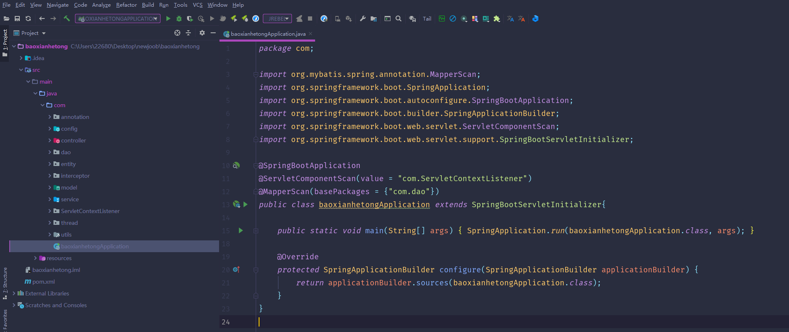

数据库表

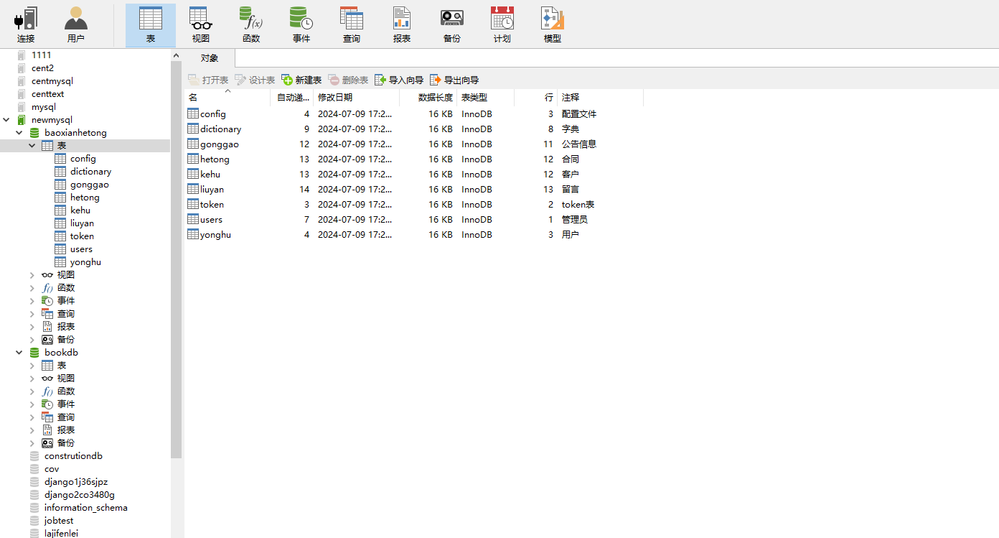

登录

前台页面首页

留言

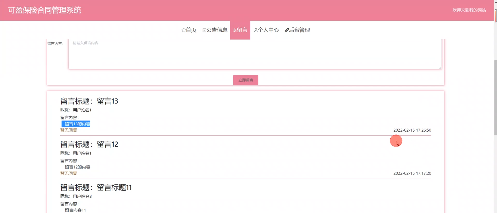

个人中心

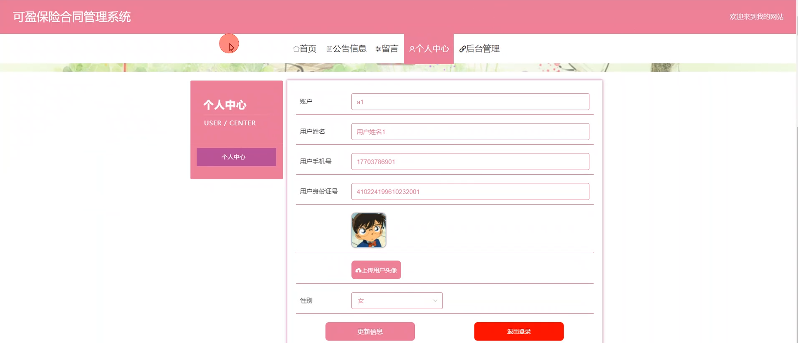

管理员端公告类型管理

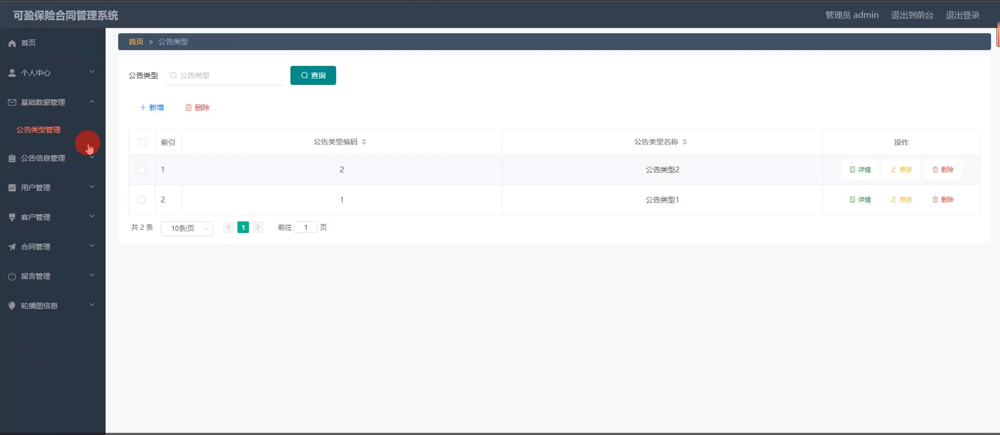

用户管理

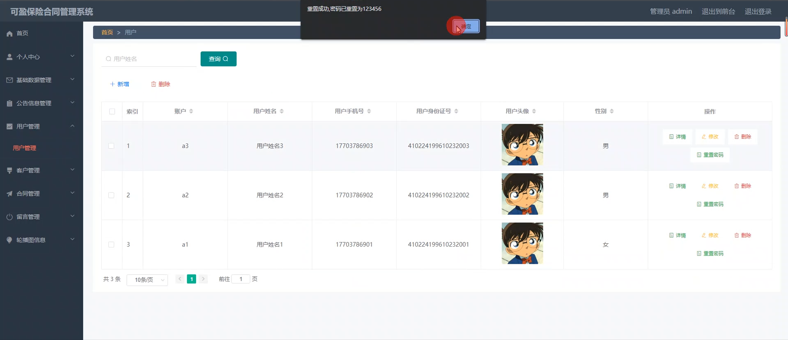

客户管理

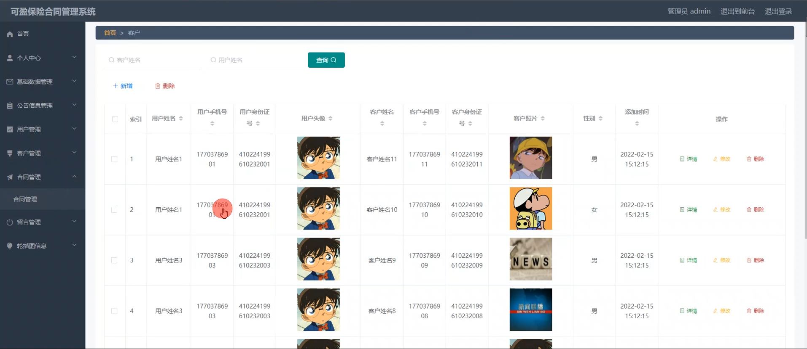

合同管理

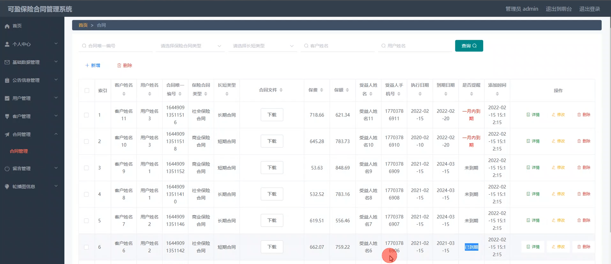

留言管理

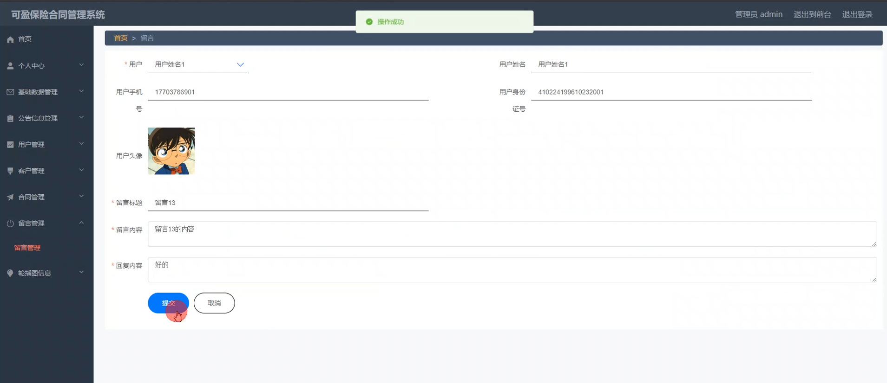

用户端个人信息

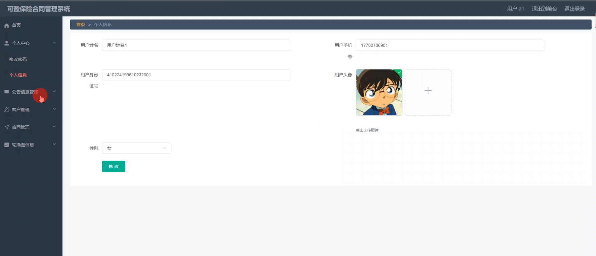

合同管理

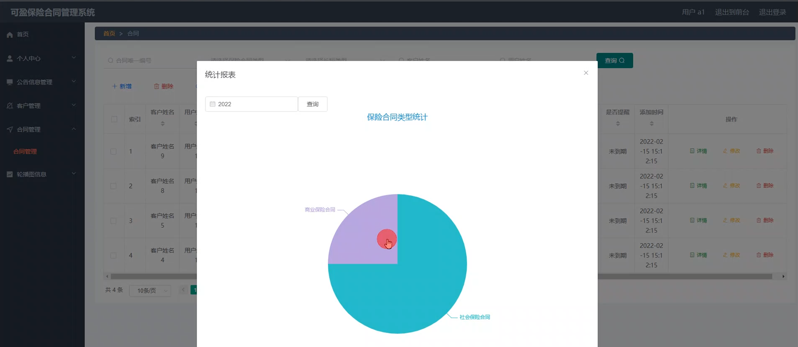

#### 总结

基于 Spring Boot 的可盈保险合同管理系统通过合理的角色划分和功能模块设计，为管理员和用户提供了便捷、高效的服务。管理员能够全面掌控保险业务的各个环节，实现精细化管理；用户能够方便地获取信息和管理自己的保险事务。该系统有助于提升保险合同管理的水平，促进保险业务的健康发展，为保险行业的数字化转型提供了有力的支持。

#### 使用说明

创建数据库，执行数据库脚本 修改jdbc数据库连接参数 下载安装maven依赖jar 启动idea中的springboot项目

前台登录页面
http://localhost:8080/baoxianhetong/front/index.html

后台登录页面
http://localhost:8080/baoxianhetong/admin/dist/index.html

管理员			账户:admin 	密码：admin
用户				账户:a1 		密码：123456
用户				账户:a2 		密码：123456
用户				账户:a3 		密码：123456